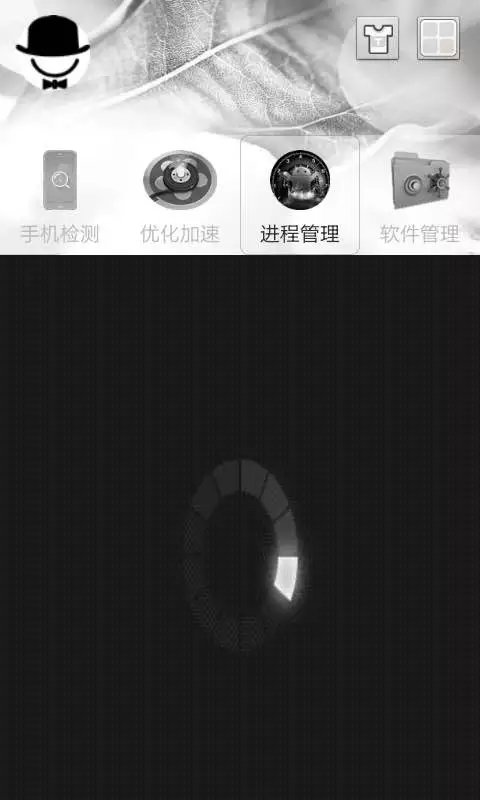
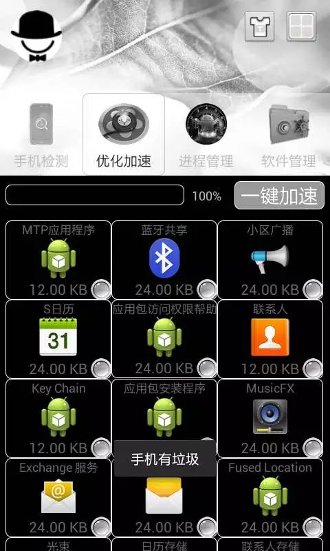

# RunAndroid
《奔跑吧安卓》是一款安卓手机检测，缓存清理，进程释放与软件管理相结合的开源应用软件。
  
【注释：此项目为2016年创建，代码实现有部分API过时和不可使用，请参考官方新的API。】

| 手机检测 | 缓存清理 | 进程管理 | 软件/应用详情 |
| ----------- | ----------- | ----------- | ----------- |
|  |  |  |  |
|				    |  |  | 					      |
